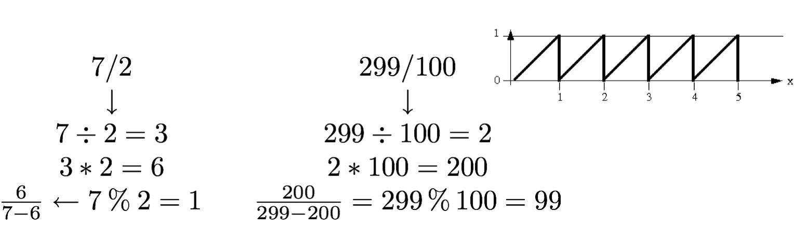

#Image IO Demos

A simple set of demo programs to demonstrate using [ImageMagick](http://www.imagemagick.org/) for reading and writing images.

##[SimpleImage](https://github.com/NCCA/ImageIO/blob/master/SimpleImage/SimpleImageWrite.cpp)
Basic image writing using ImageMagick
##[PutPixel](https://github.com/NCCA/ImageIO/blob/master/PutPixel/PutPixel.cpp) 
Same as above but adding more functionality and [boost::scoped_array<>](http://www.boost.org/doc/libs/1_57_0/libs/smart_ptr/scoped_array.htm)
##[ModImage](https://github.com/NCCA/ImageIO/blob/master/ModImage/PutPixel.cpp)   
Using the modulus operator for repeated patterns
##[Sphere](https://github.com/NCCA/ImageIO/blob/master/Sphere/PutPixel.cpp)
A procedural sphere 
##[ModSphere](https://github.com/NCCA/ImageIO/blob/master/ModSphere/PutPixel.cpp) 
A repeated procedural sphere using the [fmod](http://www.cplusplus.com/reference/cmath/fmod/) function
##[MipMap](https://github.com/NCCA/ImageIO/blob/master/MipMap/MipMap.cpp)
A simple program to demonstrate the principles of [Mip Mapping](http://en.wikipedia.org/wiki/Mipmap)   

# Lecture Notes Creating Images
- Using dynamic memory allocation we can create an array for an RGB image.
- The easiest way to do this is as follows
  - Create an array based on the Width, Height and Number of Pixels in the Image depth
  - Loop through these and fill in the pixels for each RGB Component
  - Write to some image file format
  - Free the array
Most of the steps for this are simple but the saving of the image file relies on another library

## ImageMagick / Magick++
- Magick++ provides a simple C++ API to the ImageMagick image processing library which supports reading and writing a huge number of image formats as well as supporting a broad spectrum of traditional image processing operations. 
- Magick++ provides access to most of the features available from the C API but in a simple object-oriented and well-documented framework.
- For More details look at the following url : http://www.imagemagick.org/Magick++/
- The simplest operation with the Magick++ Library is the dumping of an array to an image file. 
- This will be used in the following example

```
#include <Magick++.h>
#include <iostream>
#include <cstdlib>
#include <memory>
#include <algorithm>


int main()
{
  constexpr unsigned int           WIDTH     = 800;
  constexpr unsigned int           HEIGHT    = 800;
  constexpr auto                   imageSize = WIDTH * HEIGHT * 3 * sizeof(unsigned char);
  // c++ 11
  std::unique_ptr<unsigned char[]> image( new unsigned char[imageSize]);
  // c++ 14
  //std::unique_ptr<unsigned char[]> image=std::make_unique<unsigned char []>(imageSize);

  // set pixel as lambda
  auto setPixel = [&image](size_t _x, size_t _y, unsigned char _r, unsigned char _g, unsigned char _b)
  {
    size_t index           = (_y * WIDTH * 3) + _x * 3;
    image.get()[index]     = _r;
    image.get()[index + 1] = _g;
    image.get()[index + 2] = _b;
  };

  size_t checkSize=10;

  for(size_t y=0; y<HEIGHT; ++y)
	{
    for(size_t x=0; x<WIDTH; ++x)
		{
      if( (x /checkSize + y /checkSize) % 2  < 1 )
			{
        setPixel(x,y,255,0,0);
			}
			else
			{
        setPixel(x,y,255,255,255);
			}
		}
	}

	Magick::Image output(WIDTH,HEIGHT,"RGB",Magick::CharPixel,image.get());
	output.depth(16);
  output.write("Test.jpg");
	return EXIT_SUCCESS;
}
```

## Building
- Like SDL image magick has a config script we can use in qmake

```
######################################################################
# Automatically generated by qmake (2.01a) Thu Jan 24 19:42:29 2013
######################################################################

TARGET = PutPixel 
CONFIG -= app_bundle
DEPENDPATH += .
INCLUDEPATH += .

#QMAKE_CXXFLAGS+=$$system(Magick++-config --cppflags )
#LIBS+=$$system(Magick++-config --ldflags --libs )
CONFIG+=c++11
# Input
SOURCES += PutPixel.cpp
macx:QMAKE_CXXFLAGS+=-DMAGICKCORE_HDRI_ENABLE=1 -DMAGICKCORE_QUANTUM_DEPTH=16 -DMAGICKCORE_HDRI_ENABLE=1 -DMAGICKCORE_QUANTUM_DEPTH=16 -DMAGICKCORE_HDRI_ENABLE=1 -DMAGICKCORE_QUANTUM_DEPTH=16 -I/usr/local/include/ImageMagick-6
macx:LIBS+= -L/usr/local/lib -lMagick++-6.Q16 -lMagickWand-6.Q16 -lMagickCore-6.Q16

```

## Why not use char[][]?

- You will notice that the array used for the image data is a char []
- You may think it would be easier to use a two dimensional array for x,y co-ordinates
- However we will see in various examples this is not the case.
- It doesn’t take much code to allow use to set individual pixels in a single char [] array.

## The % (modulus) Operator
- The remainder operator (%) returns the integer remainder of the result of dividing the first operand with the second
- For example the value of 7 % 2 is 1
